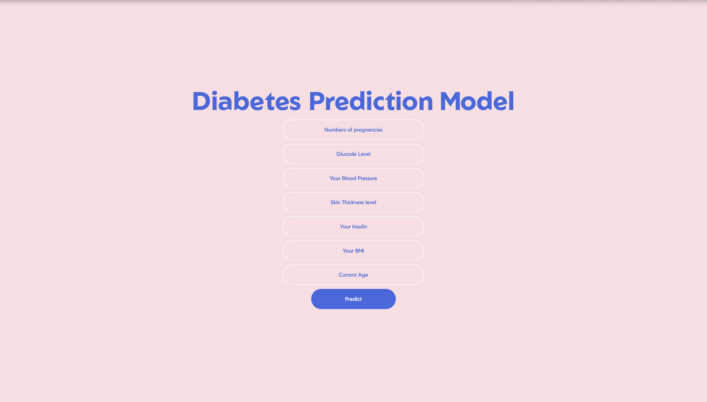

# 🩺 Diabetes Prediction using Gaussian Naive Bayes

A Machine Learning project that predicts whether a person is likely to have diabetes using the **Pima Indians Diabetes Dataset**.  
The model is built using **Gaussian Naive Bayes** and deployed through a clean and simple **Flask web application** with an HTML/CSS front-end.

---

## 📊 Model Overview

- **Algorithm:** Gaussian Naive Bayes  
- **Accuracy:** ~74%  
- **Dataset:** Pima Indians Diabetes Dataset  
- **Goal:** Predict diabetes based on medical measurements such as glucose level, BMI, pregnancies, etc.

---

## 🚀 Features

- Trained Naive Bayes ML model  
- Interactive Flask web app for real-time predictions  
- Simple and responsive HTML/CSS UI  
- Clean project structure for easy understanding  
- Includes dataset and model training script  

---

## 🖼️ Screenshot



---

## 📂 Project Structure

```text
project/
├── main.py               # Flask application
├── train_model.py        # Model training script
├── diabetes.csv          # Dataset
├── model.pkl             # Trained model
│
├── templates/
│   └── index.html        # Web interface
│
├── static/
│   └── style.css         # Stylesheet
│
└── screenshot/
    └── home.png          # App UI screenshot

🔧 Installation & Setup
1️⃣ Clone the repository

git clone https://github.com/your-username/your-repo-name.git
cd your-repo-name

2️⃣ Install dependencies

pip install -r requirements.txt

3️⃣ Train the model (optional)

python train_model.py

4️⃣ Run the Flask application

python main.py

5️⃣ Open in browser

http://127.0.0.1:5000/

🧠 How It Works

User enters medical data (glucose, insulin, age, BMI, etc.).
Data is forwarded to the Flask backend.
The trained Naive Bayes model processes input and predicts diabetes probability.
The result is displayed instantly on the web interface.

🛠️ Tech Stack

Python
Flask
Scikit-learn
NumPy
Pandas
HTML / CSS

📜 License

This project is open-source and available under the MIT License.

🤝 Contributing

Pull requests and suggestions are always welcome!